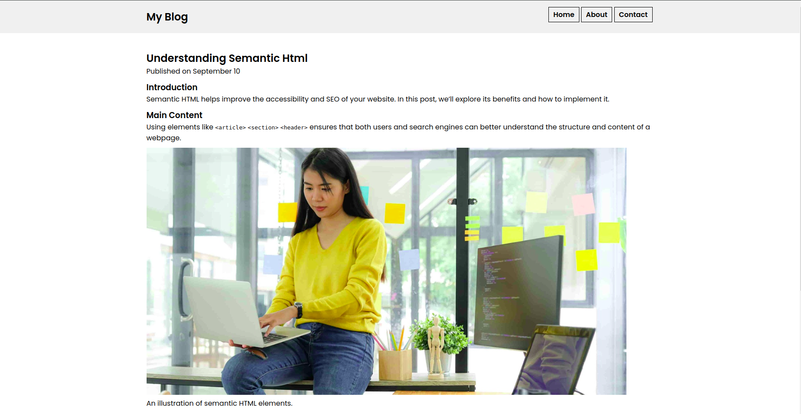
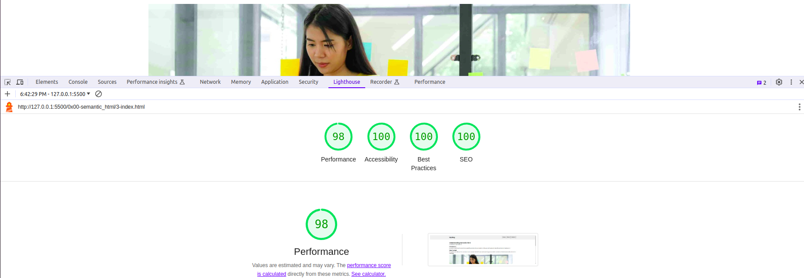

# Accessibility and SEO
This project focuses on demonstrating the best practices in using Semantic HTML while emphasizing accessibility, SEO optimization, and the implementation of ARIA roles for enhanced usability.

## Live link
[Demo link >>](https://felix45.github.io/alx-intermediate-frontend)

## Page Screenshot

## Page Performance

